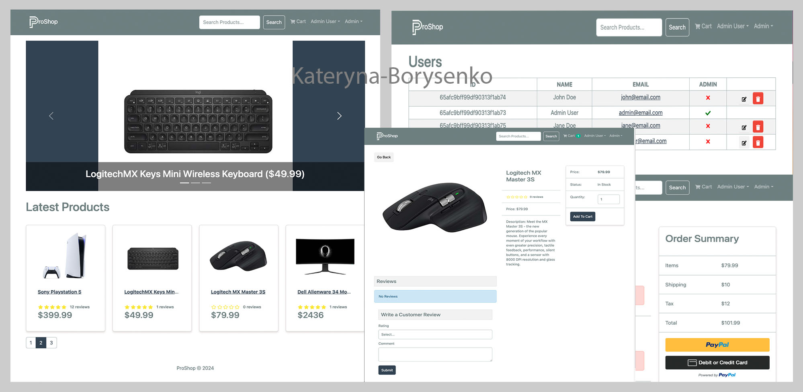

<!-- для одновременного запуска backend and client использую concurrently
в терминале  с корневой папки proshop  ->  npm run dev

Команда npm i bcrypt используется для установки библиотеки bcrypt в Node.js проект. bcrypt - это библиотека для хеширования паролей, которая обеспечивает безопасное хранение паролей пользователей в вашей базе данных.

Основные функции bcrypt включают:

Хеширование паролей: Преобразует обычные текстовые пароли в хешированный формат, что делает их безопасными для хранения. Даже если кто-то получит доступ к базе данных, он не сможет легко восстановить исходные пароли.
Соль (Salt) и Раунды хеширования: bcrypt автоматически добавляет "соль" к паролям перед хешированием и поддерживает настройку количества раундов хеширования, что увеличивает безопасность и устойчивость к атакам подбора паролей.
Использование bcrypt считается одним из лучших подходов к безопасному хранению паролей в веб-приложениях.

 package.json проекта Node.js, которые упрощают запуск команд для импорта или удаления данных:

"data:import": "node backend/seeder" - Этот скрипт запускает файл seeder в директории backend. При его выполнении (командой npm run data:import) запустится функция importData, которая, как предполагается, импортирует данные в базу данных.

"data:destroy": "node backend/seeder -d" - Этот скрипт также запускает seeder, но с дополнительным аргументом -d. При выполнении (npm run data:destroy) активируется функция destroyData, которая удалит данные из базы данных.

Использование этих скриптов упрощает процесс управления данными, позволяя быстро и легко импортировать или удалять данные, используя команды npm run.

запуск npm run data:import -> переходим в composs -> 'on the manu bar - вверху возле яблока' View -> Reload Data
 -->

# ProShop eCommerce Platform

> eCommerce platform built with the MERN stack & Redux.

<p>
    
    
    
    
    
    
    
    
    
</p>



## Features

- Full featured shopping cart
- Product reviews and ratings
- Top products carousel
- Product pagination
- Product search feature
- User profile with orders
- Admin product management
- Admin user management
- Admin Order details page
- Mark orders as delivered option
- Checkout process (shipping, payment method, etc)
- PayPal / credit card integration
- Database seeder (products & users)

## Usage

```
Sample User Logins

Email: admin@email.com (Admin)
Password: 123456

Email: customer@email.com (Customer)
Password: 123456
```

- Create a MongoDB database and obtain your `MongoDB URI` - [MongoDB Atlas](https://www.mongodb.com/cloud/atlas/register)
- Create a PayPal account and obtain your `Client ID` - [PayPal Developer](https://developer.paypal.com/)

### Install Dependencies (frontend & backend)

```
npm install
cd frontend
npm install
```

### Run

```
# Run frontend (:3000) & backend (:5000)
npm run dev

# Run backend only
npm run server
```

## Build & Deploy

```
# Create frontend prod build
cd frontend
npm run build
```

### Seed Database

You can use the following commands to seed the database with some sample users and products as well as destroy all data

```
# Import data
npm run data:import

# Destroy data
npm run data:destroy
```
